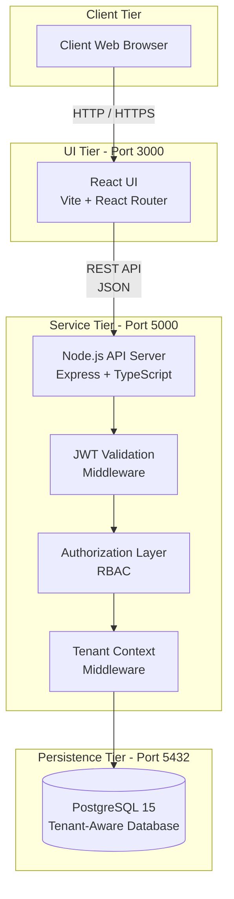
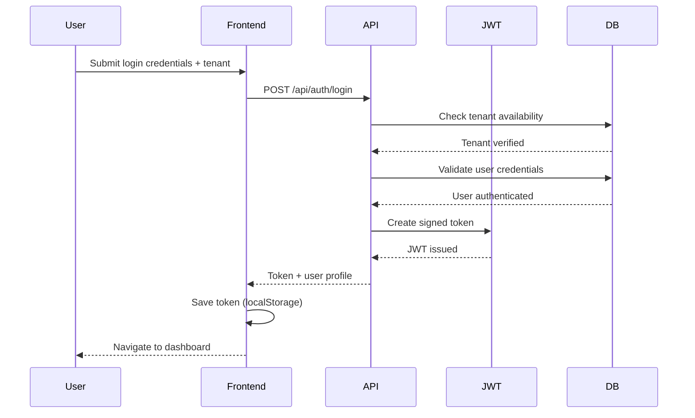
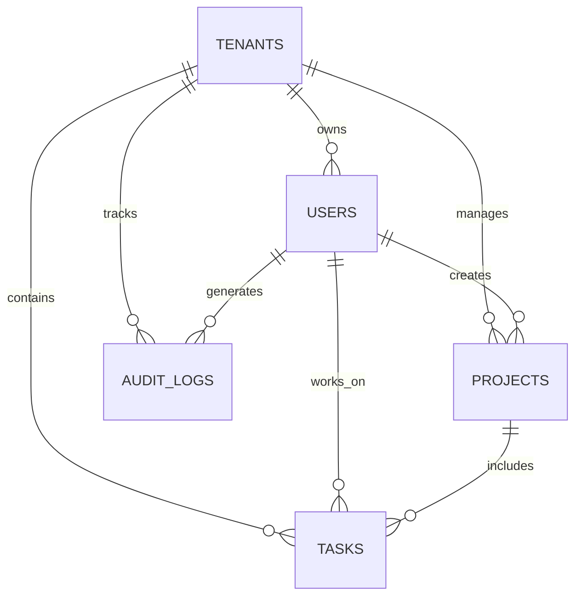
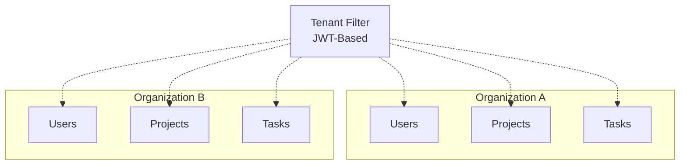

# Architecture Overview Document

## Platform Architecture

### High-Level System Design



---

## Architectural Layers

### Client Tier

* End users interact with the system through standard web browsers
* Communication occurs over HTTP or HTTPS

### Frontend Tier (Port 3000)

* Built using **React 18** with **Vite** for fast builds
* **React Router** handles client-side navigation
* Authentication-protected routes restrict unauthorized access
* Fully responsive user interface for multiple screen sizes

### Backend Tier (Port 5000)

* REST API implemented using **Express.js** with **TypeScript**
* **JWT Authentication Middleware** validates access tokens
* **Role-Based Access Control (RBAC)** enforces permission rules
* **Tenant Context Middleware** ensures tenant-level data separation
* Standardized request validation and error handling

### Database Tier (Port 5432)

* **PostgreSQL 15** used for reliable data storage
* Shared database with tenant-scoped records
* **Prisma ORM** for type-safe database access
* Schema migrations and seed scripts automated

---

## Authentication Process



---

## Database Design

### Entity Relationship Model



---

### Core Entities

#### TENANTS

* Represents organizations using the platform
* Subdomain uniquely identifies each tenant
* Stores subscription tier and usage limits
* Tracks lifecycle status

#### USERS

* Holds user credentials and profile data
* Linked to a tenant (except super administrators)
* Enforces unique email per tenant
* Role-driven permissions

#### PROJECTS

* Logical grouping of work items
* Owned by a tenant
* Created and managed by users
* Lifecycle controlled via status field

#### TASKS

* Individual actionable items
* Associated with both project and tenant
* Can be assigned to users
* Supports priorities and workflow states

#### AUDIT_LOGS

* Captures system activity for auditing
* Records user actions and affected entities
* Stores timestamps and originating IP addresses

---

## Tenant Data Separation



### Isolation Approach

* All tenant-owned records include a `tenant_id`
* JWT tokens carry tenant context
* Middleware automatically scopes all database queries
* Super administrators bypass tenant restrictions
* Cascading deletes maintain referential integrity
* Indexed tenant columns ensure query efficiency

---

## API Design Structure

### Authentication

* `POST /api/auth/register-tenant` – Create a new organization
* `POST /api/auth/login` – Authenticate user
* `GET /api/auth/me` – Retrieve logged-in user
* `POST /api/auth/logout` – End user session

### Tenant Operations

* `GET /api/tenants` – Fetch all tenants (super_admin)
* `GET /api/tenants/:tenantId` – Tenant details
* `PUT /api/tenants/:tenantId` – Update tenant info

### User Operations

* `POST /api/tenants/:tenantId/users` – Create user
* `GET /api/tenants/:tenantId/users` – List users
* `PUT /api/users/:userId` – Update user
* `DELETE /api/users/:userId` – Remove user

### Project Operations

* `POST /api/projects` – Create project
* `GET /api/projects` – Retrieve projects
* `PUT /api/projects/:projectId` – Modify project
* `DELETE /api/projects/:projectId` – Delete project

### Task Operations

* `POST /api/projects/:projectId/tasks` – Add task
* `GET /api/projects/:projectId/tasks` – View tasks
* `PATCH /api/tasks/:taskId/status` – Change task status
* `PUT /api/tasks/:taskId` – Update task
* `DELETE /api/tasks/:taskId` – Remove task

### System Utilities

* `GET /api/health` – Service health check

---

## API Security Model

### Authentication

* Stateless JWT-based security
* Token validity: 24 hours
* Payload includes user ID, tenant ID, and role

### Authorization Layers

* **Public** – Open endpoints
* **Authenticated** – Valid token required
* **Role-Constrained** – Permission-based access
* **Tenant-Bound** – Tenant ownership enforced

### Request Lifecycle

1. Client sends request with JWT
2. Token validation middleware runs
3. Role permissions verified
4. Tenant scope applied
5. Business logic executed
6. Response returned

---

## Standard Response Structure

### Success

```json
{
  "success": true,
  "message": "Optional message",
  "data": {}
}
```

### Failure

```json
{
  "success": false,
  "message": "Error details"
}
```

### HTTP Status Usage

* 200 – Request successful
* 201 – Resource created
* 400 – Invalid input
* 401 – Authentication required
* 403 – Access denied
* 404 – Resource missing
* 409 – Conflict detected
* 500 – Server failure

---

For complete API specifications, refer to **API.md**.
For exported diagram images, see **images/diagrams.md**.

---